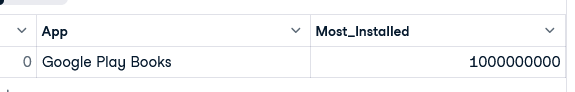
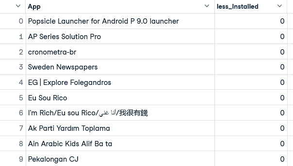
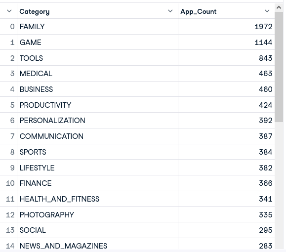
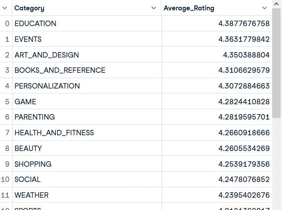
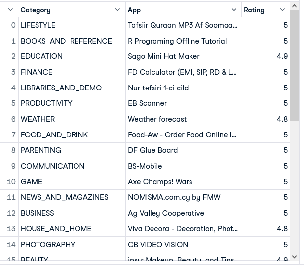
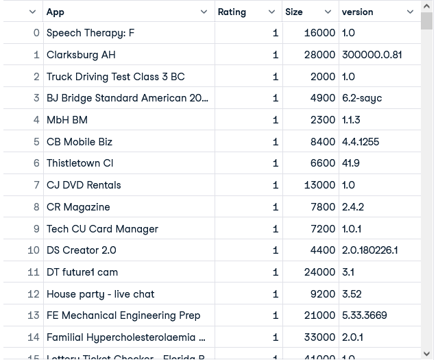
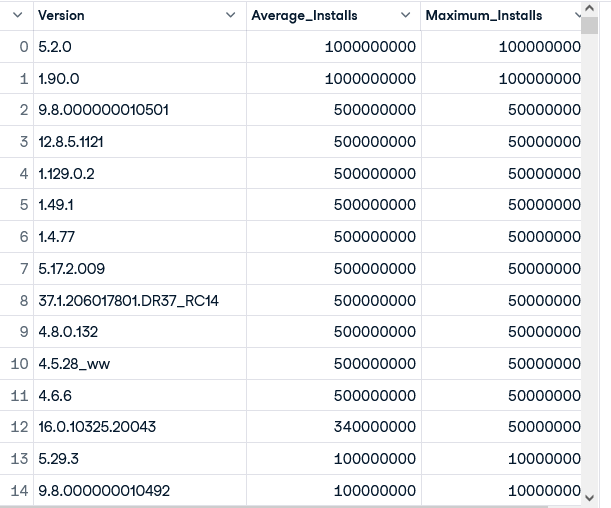
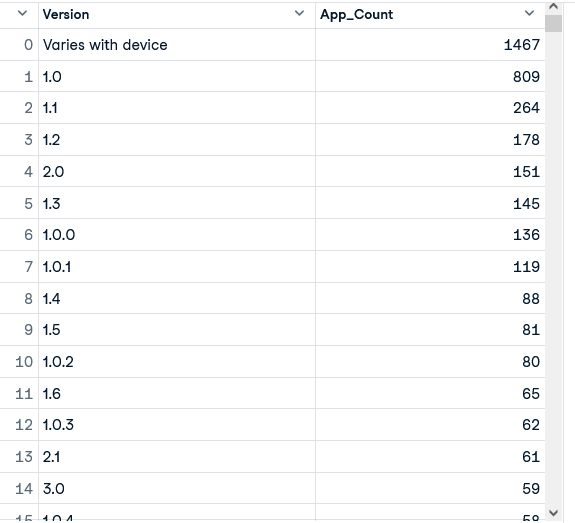

# Play store apps Data analysis with SQL

## Quick overview
Welcome to the Play Store Analysis project! This repository showcases a comprehensive analysis of app data from the Google Play Store using SQL. By leveraging a rich dataset, the project aims to uncover insights related to app performance, user ratings, and versions in various categories. All key feautures and research questions were 

## Key features of this analysis include
- Data Exploration: Initial exploration of app attributes, including ratings, downloads, and categories.
- Trends and Patterns: Identification of trends in user preferences and app popularity over time.
- Comparative Analysis: Comparison of top-performing apps to understand what drives success in the Play Store.

  ## Research questions
  1. which is the app has the highest number of installation?
  2. which are the top 10 apps with lowest number on installation?
  3. what are the most installed app in various categories?
  4. What are the average ratings of apps by category?
  5. What are the top-rated apps in each category?
  6. What is the correlation between app size, app version, and user ratings on the Google Play Store?
  7. Does the app version affect the number of installations?
  8. What are the most popular app categories by reviews ?
  9. What are the most common app versions on the Google Play Store?
  10. What are the factores influencing top installed app and least installed app.

 ## Goals this project aims to achieve
 
 The primary goal of this research project is to analyze app data from the Google Play Store to uncover trends and insights that inform developers and stakeholders about app performance and user preferences. By addressing the research questions, we aim to
 
- Identify key factors influencing app installations and ratings.
- Understand the dynamics of app popularity across different categories.
- Assess the impact of app size, version, and other characteristics on user satisfaction and engagement.
- Provide actionable insights that can guide future app development and marketing strategies.
    
Ultimately, this analysis seeks to enhance the understanding of the mobile app landscape, benefiting both developers and users.

 ### Disclaimer: 
 The data presented in this analysis is based on research and publicly available information from the Google Play Store. The datasets used are not curated by me and may contain inaccuracies or discrepancies. The insights drawn from this data are intended for informational purposes only and should be interpreted with caution.

 ## SQL query and Ouput

 1.which is the app has the highest number of installation?
 This question aims to identify the app with the greatest number of installations, providing insights into its popularity and user acceptance.
 
     SELECT App, MAX(Installs) as Most_Installed
     FROM 'Google_playstore_apps.csv'
     GROUP BY App
     ORDER BY Most_Installed DESC
     LIMIT 1

  Output
  
  
  
2.which are the top 10 apps with lowest number on installation?
     This question seeks to identify the apps with the lowest number of installations, providing insights into potential challenges they face in gaining user traction.

        SELECT App, MIN(Installs) as less_Installed
        FROM 'Google_playstore_apps.csv'
        GROUP BY App
        ORDER BY less_Installed 
        LIMIT 10

Output:

3.what are the most installed app in various categories?
     This question aims to identify the most installed app in various categories (e.g., games, productivity, social media) on the Google Play Store. Analyzing installation data by category allows us to understand trends in user preferences and behaviors across different types of applications.

       SELECT 
       Category, 
       COUNT(App) AS App_Count
       FROM 'Google_playstore_apps.csv'
       GROUP BY Category
       ORDER BY App_Count DESC

  Ouput:

  
  
  
4.what are the average ratings of apps by category?
     This question seeks to determine the average user ratings for apps within each category . By analyzing average ratings, we can gain insights into overall user satisfaction and quality perceptions across different types of applications.
     

        SELECT 
        Category, 
        AVG(Rating) AS Average_Rating
        FROM 'Google_playstore_apps.csv'
        GROUP BY Category
        ORDER BY Average_Rating DESC

Output:

5.What are the top-rated apps in each category?

     SELECT 
     Category, 
     App, 
     Rating
     FROM (
     SELECT 
        Category, 
        App, 
        Rating, 
        ROW_NUMBER() OVER (PARTITION BY Category ORDER BY Rating DESC) AS rank
     FROM 'Google_playstore_apps.csv'
     ) AS ratings
     WHERE rank = 1

   Output:

   
   

6.What is the correlation between app size, app version, and user ratings on the Google Play Store?

      SELECT 
      App,
      Rating,
      Size,
      Current_Ver AS version
      FROM 'Google_playstore_apps.csv'
      WHERE Rating < 3.0
      ORDER BY Rating ASC

   Output:

   

7.Does the app version affect the number of installations?

        SELECT 
        Current_Ver AS Version, 
        AVG(CAST(REPLACE(REPLACE(CAST(Installs AS VARCHAR), '+', ''), ',', '') AS INTEGER)) AS Average_Installs,
	      MAX(CAST(REPLACE(REPLACE(CAST(Installs AS VARCHAR), '+', ''), ',', '') AS INTEGER)) AS Maximum_Installs
        FROM 'Google_playstore_apps.csv'
        GROUP BY Current_Ver
        ORDER BY Average_Installs DESC
        
 Output:

 

    
8.What are the most popular app categories by reviews ?

      SELECT 
      App,
      Category,
      Reviews
      FROM 'Google_playstore_apps.csv'
      ORDER BY Category, Reviews DESC
      LIMIT 10

  Ouput:

  

     
9.What are the most common app versions on the Google Play Store?

      SELECT 
      Current_Ver AS Version, 
      COUNT(App) AS App_Count
      FROM 'Google_playstore_apps.csv'
      GROUP BY Current_Ver
      ORDER BY App_Count DESC

Output:

      

  
      
